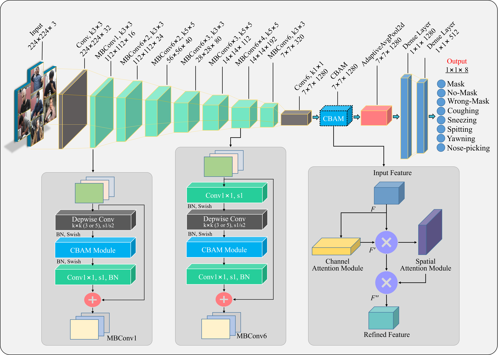
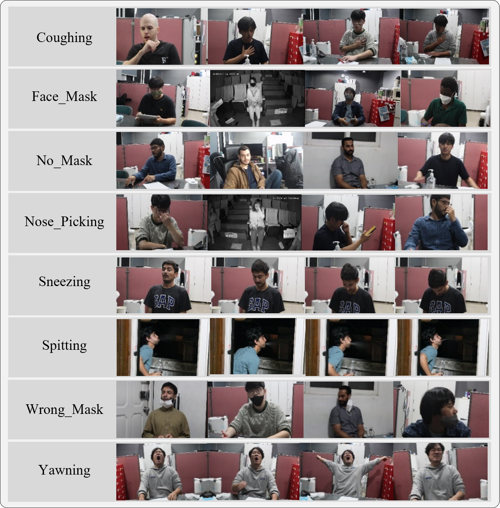

# Enhanced-anomaly-detection-in-pandemic-surveillance-videos
 
[](https://doi.org/10.1109/ACCESS.2024.3488797)  


This repository is the ```official open-source``` of [Enhanced anomaly detection in
pandemic surveillance videos: An attention approach with EfficientNet-B0 and CBAM integration](https://doi.org/10.1109/ACCESS.2024.3488797)
by SAREER UL AMIN, MUHAMMAD SIBTAIN ABBAS, BUMSOO KIM, YONGHOON JUNG,
AND SANGHYUN SEO

## Description
We present a novel system for anomaly detection in surveillance videos, specifically focusing
on identifying instances where individuals deviate from public health guidelines during the pandemic. These anomalies encompassed behaviours like the absence of face masks, incorrect mask usage, coughing, nose-picking, sneezing, spitting, and yawning. Monitoring such anomalies manually was challenging and prone to errors, necessitating automated solutions. To address this, a multi-attention-based deep learning system was employed, utilizing the EfficientNet-B0 architecture. EfficientNet-B0, featuring the Mobile Inverted Bottleneck Convolution (MBConv) block with Squeeze-and-Excitation (SE) modules, emphasizes informative channel characteristics while disregarding irrelevant ones. However, this approach neglected
crucial spatial information necessary for visual recognition tasks. To improve this, the Convolutional Block Attention Module (CBAM) was integrated into EfficientNet-B0 to improve feature extraction. The baseline EfficientNet-B0 model’s SE module was replaced with the CBAM module within each MBConv module to retain spatial information related to anomaly activities. Additionally, the CBAM module, when embedded after the second convolutional layer, was observed to significantly enhance the classification ability of the model across different anomaly classes, resulting in a significant accuracy boost from 87 to 96%. In conclusion, we demonstrated the efficacy of the CBAM module in refining feature extraction and improving
the classification performance of the proposed method, showcasing its potential for robust anomaly detection in surveillance videos.


## Prerequisites
- Python 3.9
- keras 2.9.0
- tensorflow-gpu 2.9.1
- CUDA toolkit 11.0
- cuDNN 8.0
- tensorboard 2.9.1
- scikit-learn 1.0.2
- numpy 1.21.6
- opencv 3.4.1
- matplotlib 3.5.3
- seaborn 0.12.2

This method was tested in:
- **GPU**: RTX 3070 with 32 GB memory


## Usage
Clone the repository:
```bash
git clone https://github.com/sareerulamin/Enhanced-anomaly-detection-in-pandemic-surveillance-videos.git
```

## Installation 
To create a conda environment with the required packages, use the following command:
```bash
conda env create -f environment.yml
```

## OurDataset 
The Canon EOS 600D is a versatile DSLR camera that offers a range of video features for research purposes. The camera provides Full high-dimensional (HD) 1080p video recording
at 30 frames per second, which is ideal for capturing detailed footage. It also offers manual control over exposure, focus, and audio levels, which allows for greater control and precision
in video recordings. Additionally, the camera has a built-in microphone and a jack for an external microphone, which is useful for capturing high-quality audio. One of the most significant video features of the Canon EOS 600D is its movie crop mode. This feature allows researchers to zoom in on subjects and capture footage with greater detail, even from a distance. The camera also has a video snapshot mode, which is useful for capturing short clips that can be combined into a longer video. Finally, the vari-angle LCD screen provides a clear view of the scene from different angles, making it easier to capture footage from unique perspectives. Overall, the Canon EOS 600D is an excellent camera for research
purposes, offering a range of video features and manual controls for greater precision and control in video recordings. However, in this study, the Canon EOS 600D camera has been used for capturing anomaly activity in indoor environments. We made an anomaly detection dataset for eight different types of anomaly activities, including coughing, face mask, no mask, nose picking, sneezing, spitting, wrong mask, and yawning. Each anomaly activity consists of 18 videos of approximately one-minute duration. In this study, the face mask class is considered a normal activity, while the rest of the classes are considered anomalous activity. 

You can download OurDataset using the download link provided below.

|  File Name |  Download   |   
|:-----------|:-----------|
|OurDataset.zip| [Google Drive](https://drive.google.com/file/d1V_9reWS_hTx1wPXYqKIAHQwpklM1LyaV/view?usp=sharing)|

```
OurDataset
├── testing
    └── frames
        └── Class 01
            ├── 1.jpg
            ├── ...
            └── n.jpg
        ├── Class 02
        ├── ...
        └── Class 08
└── training
    └── frames
        ├── Class 01
            ├── 1.jpg
            ├── ...
            └── n.jpg
        ├── Class 02
        ├── ...
        └── Class 08
```



## Training

To train the model with all default values, use the following script:

```bash
train.ipynb 
```

## Testing

To test and evaluate the model, use the following script:

```bash
testing_model.ipynb 
```
## Qualitative Evaluation
Visualization Results of Gradient-weighted Class Activation Mapping (Grad-CAM). We compare the proposed approach’s (EfficientNet-B0 + CBAM) visual results with those of the baseline (EfficientNet-B0), Vision Transformer, and Swin Transformer. The last Conv layer outputs are used to compute the grad-CAM visualization. Every input image has the ground truth presented at the top.


## Citation
If you find this code useful, please cite our paper:
```bash
@article{gupta2024video,
  title={Video Anomaly Detection Based on HSOE-FAST Modified Deep Neural Network},
  author={Gupta, Anil Kumar and Sharma, Rupak and Ojha, Rudra Pratap},
  journal={SN Computer Science},
  volume={5},
  number={5},
  pages={588},
  year={2024},
  publisher={Springer}
}
```

## Acknowledgments
This research was supported by the MSIT (Ministry of Science and ICT), Korea, under the ITRC (Information Technology Research Centre) support program (IITP-2024-RS-2024-00438056), supervised by the IITP (Institute for Information & Communications Technology Planning & Evaluation).

## Contact
```
sareerulamin320@gmail.com

```
